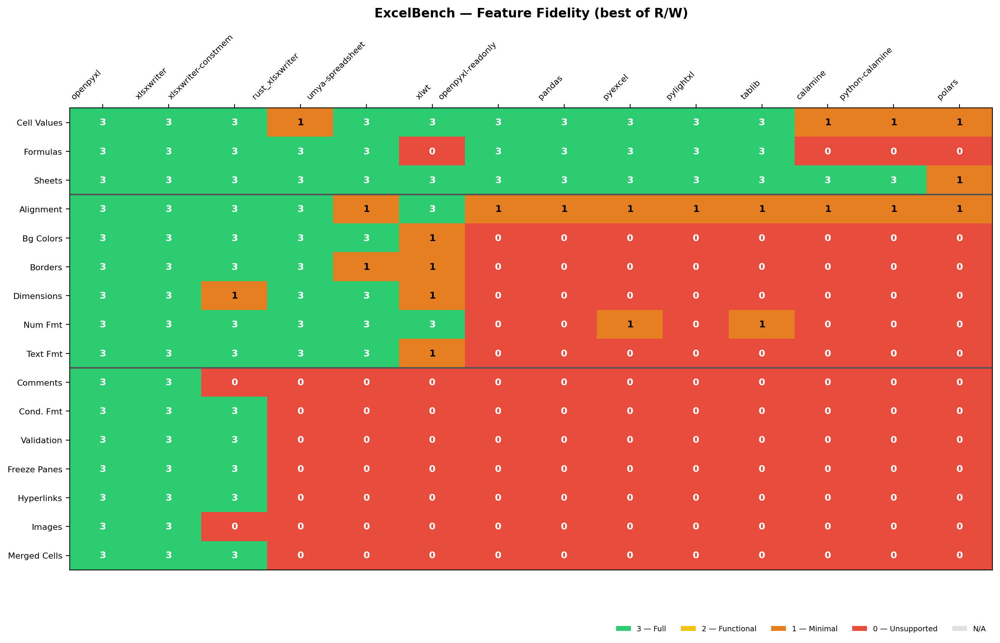

# ExcelBench

**Objective, reproducible fidelity scores for Python Excel libraries.**

Most Excel library comparisons focus on speed. ExcelBench answers the question developers actually have: **"Can this library handle my complex spreadsheet?"**

We test 17 XLSX features across 12+ Python adapters. In current public runs, 16 are scoreable
across libraries (pivot tables are tested but N/A on macOS fixtures).

## Results at a Glance

> Last run: 2026-02-17 | Excel 16.105.3 | macOS (Apple Silicon) | [Full results](results/xlsx/README.md)



**The story:** Every Python Excel library faces a speed-fidelity tradeoff. openpyxl achieves full fidelity (16/16) but reads at 284K cells/s. python-calamine reads at 1.6M cells/s but scores 1/16 green. **WolfXL breaks this tradeoff** -- its hybrid Rust+Python architecture delivers near-full fidelity (14/16) at 3-9x the throughput of openpyxl, with a unique patch-based modify mode that no other library offers. Once you move past basic cell values, nearly every other library drops to zero on formatting, comments, hyperlinks, images, merged cells, and conditional formatting.

### Library Comparison

| Library | Caps | Fidelity | Read Speed | Write Speed | Modify |
|---------|:----:|:--------:|:----------:|:-----------:|:------:|
| **wolfxl** | R+W | 14/16 | **9x** faster | **4.5x** faster | Patch |
| openpyxl | R+W | 16/16 | 1x (baseline) | 1x (baseline) | Rewrite |
| xlsxwriter | W | 15/16 | -- | ~1x | No |
| xlsxwriter-constmem | W | 12/16 | -- | ~2x | No |
| python-calamine | R | 1/16 | ~1.3x | -- | No |
| pandas | R+W | 3/16 | <1x | <1x | Rebuild |
| polars | R | 0/16 | ~1x | -- | No |

> Speed relative to openpyxl (higher = faster). WolfXL benchmarked with bulk read (1.26M cells/s) and bulk write (1.73M cells/s) vs openpyxl baseline. See [performance results](results/perf/README.md) for full numbers.

### Key Findings

- **WolfXL breaks the speed-fidelity tradeoff**: hybrid Rust+Python achieves 14/16 green features at 3-9x throughput -- the only library with both high fidelity and high speed
- **Patch modify is unique**: WolfXL's `load_workbook(path, modify=True)` does surgical ZIP patching (10-14x vs openpyxl rewrite) -- no other Python library offers this
- **The abstraction tax is real**: pandas wraps openpyxl but drops from 16 to 3 green features due to DataFrame coercion (errors become NaN)
- **Speed vs fidelity tradeoff**: xlsxwriter-constmem writes at 4.7M cells/s but loses 3 features; python-calamine reads at 1.6M cells/s but scores 1/16 green
- **Optimization modes have clear costs**: openpyxl-readonly loses 13 green features for streaming speed

See the [full dashboard](results/DASHBOARD.md) for the combined fidelity + performance comparison.

### Score Legend

| Score | Meaning |
|:------|:--------|
| 🟢 3 | **Complete** -- full fidelity, indistinguishable from Excel |
| 🟡 2 | **Functional** -- works for common cases, some edge-case failures |
| 🟠 1 | **Minimal** -- basic recognition but significant limitations |
| 🔴 0 | **Unsupported** -- errors, corruption, or complete data loss |

## Libraries Tested

### XLSX Profile (12 adapters)

| Library | Version | Lang | Caps | Green Features |
|:--------|:--------|:-----|:-----|:--------------:|
| [openpyxl](https://openpyxl.readthedocs.io/) | 3.1.5 | Python | R+W | 16/16 |
| [XlsxWriter](https://xlsxwriter.readthedocs.io/) | 3.2.9 | Python | W | 15/16 |
| [xlsxwriter-constmem](https://xlsxwriter.readthedocs.io/) | 3.2.9 | Python | W | 12/16 |
| [openpyxl-readonly](https://openpyxl.readthedocs.io/) | 3.1.5 | Python | R | 3/16 |
| [pandas](https://pandas.pydata.org/) | 3.0.0 | Python | R+W | 3/16 |
| [pyexcel](https://github.com/pyexcel/pyexcel) | 0.7.4 | Python | R+W | 3/16 |
| [tablib](https://tablib.readthedocs.io/) | 3.9.0 | Python | R+W | 3/16 |
| [pylightxl](https://github.com/PydPiper/pylightxl) | 1.61 | Python | R+W | 3/16 |
| [python-calamine](https://github.com/dimastbk/python-calamine) | 0.6.1 | Rust | R | 1/16 |
| [polars](https://pola.rs/) | 1.38.1 | Rust | R | 0/16 |
| [xlwt](https://github.com/python-excel/xlwt) | 1.3.0 | Python | W | 4/16 |
| [xlrd](https://github.com/python-excel/xlrd) | 2.0.2 | Python | R | .xls only |

### XLS Profile (2 adapters)

| Library | Green Features | Notes |
|:--------|:--------------:|:------|
| xlrd | 4/4 | Full .xls read fidelity |
| python-calamine | 2/4 | Cross-format reader |

### Optional: Rust Backends (PyO3)

Five additional adapters via Rust/PyO3 extension modules:

| Library | Caps | Source | Notes |
|:--------|:-----|:-------|:------|
| [WolfXL](https://github.com/wolfiesch/wolfxl) (calamine-styled) | R | PyPI | Full-fidelity Rust reader with style extraction |
| [WolfXL](https://github.com/wolfiesch/wolfxl) (rust_xlsxwriter) | W | PyPI | Full-fidelity Rust writer |
| calamine (basic) | R | Local | Direct calamine bindings (data only, no styles) |
| rust_xlsxwriter (direct) | W | Local | Direct rust_xlsxwriter bindings |
| umya-spreadsheet | R+W | Local | Rust read + write |

```bash
# WolfXL adapters (from PyPI — no Rust toolchain needed)
uv sync --extra rust

# Local-only adapters (requires Rust toolchain + maturin)
uv run maturin develop --manifest-path rust/excelbench_rust/Cargo.toml \
  --features calamine,rust_xlsxwriter,umya
```

> `uv sync` may uninstall locally-built extensions; rerun `maturin develop` after.

## How It Works

1. **Generate reference files** -- [xlwings](https://www.xlwings.org/) drives real Excel to produce canonical `.xlsx`/`.xls` test files with known features.
2. **Read tests** -- each library reads the Excel-generated file; extracted values are compared to the expected manifest.
3. **Write tests** -- each library writes a new file from the same spec; the output is verified by a trusted oracle (Excel via xlwings, or openpyxl in CI).
4. **Score** -- pass rates map to the 0-3 fidelity scale per feature.

Full methodology: [METHODOLOGY.md](METHODOLOGY.md)

## WolfXL Docs

WolfXL documentation lives in the [wolfxl repository](https://github.com/wolfiesch/wolfxl/tree/main/docs).

- [Quickstart](https://github.com/wolfiesch/wolfxl/blob/main/docs/getting-started/quickstart.md)
- [Openpyxl migration guide](https://github.com/wolfiesch/wolfxl/blob/main/docs/migration/openpyxl-migration.md)
- [Compatibility matrix](https://github.com/wolfiesch/wolfxl/blob/main/docs/migration/compatibility-matrix.md)
- [Benchmark methodology](https://github.com/wolfiesch/wolfxl/blob/main/docs/performance/methodology.md)
- [Known limitations](https://github.com/wolfiesch/wolfxl/blob/main/docs/trust/limitations.md)

## Quick Start

```bash
# Install
uv sync

# Run the benchmark against pre-built fixtures (no Excel required)
uv run excelbench benchmark --tests fixtures/excel --output results

# Generate the heatmap
uv run excelbench heatmap

# Generate the combined fidelity + performance dashboard
uv run excelbench dashboard

# View results
open results/xlsx/README.md  # macOS; use xdg-open on Linux
```

To regenerate canonical fixtures from scratch (requires Excel installed):

```bash
uv run excelbench generate --output fixtures/excel
```

## Feature Coverage

### Tested (17 features; 16 currently scoreable)

| Tier | Features | Count |
|:-----|:---------|:-----:|
| **Tier 0** -- Core | Cell values, formulas, multiple sheets | 3 |
| **Tier 1** -- Formatting | Text formatting, background colors, number formats, alignment, borders, dimensions | 6 |
| **Tier 2** -- Advanced | Merged cells, conditional formatting, data validation, hyperlinks, images, comments, freeze panes, pivot tables | 8 |

> Pivot tables are tested but score N/A across all adapters in the current macOS run.
> Library green-feature scores therefore use a /16 denominator (excluding pivot tables).

### Planned

Named ranges, tables, charts, print settings, protection.

## Detailed Results

- **[XLSX results](results/xlsx/README.md)** -- per-library, per-test-case breakdowns with tier list
- **[XLS results](results/xls/README.md)** -- legacy format results
- **[Performance results](results/perf/README.md)** -- throughput benchmarks (cells/s)
- **[Dashboard](results/DASHBOARD.md)** -- combined fidelity + performance comparison
- **[Heatmap (PNG)](results/xlsx/heatmap.png)** | **[SVG](results/xlsx/heatmap.svg)** -- visual score matrix

## Project Status

**v0.1.0** -- 17 features tested, 12 Python xlsx adapters + 2 xls + 5 Rust/PyO3.

1126 tests passing. Actively maintained.

## Contributing

See [CONTRIBUTING.md](CONTRIBUTING.md) for setup instructions, how to add features, and how to add library adapters.

## License

MIT
